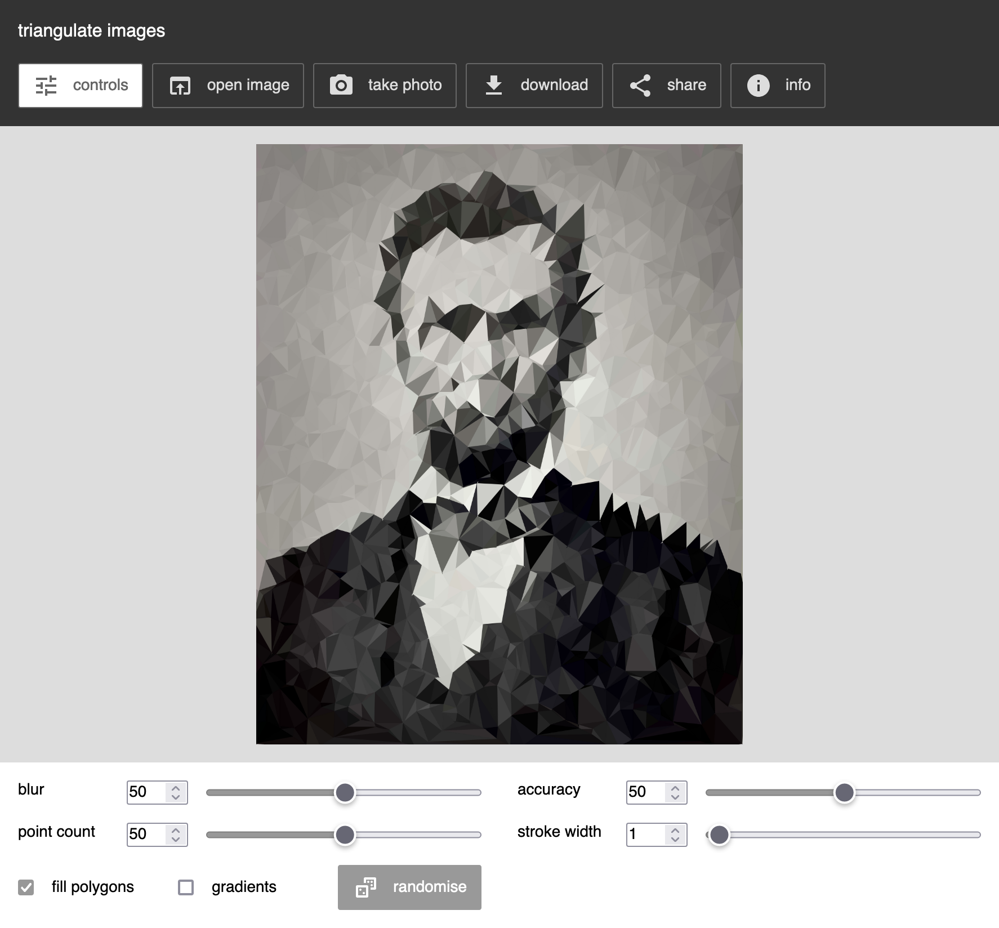

image triangulation experiment
===

this is an experiment for the web browser. it uses the [delaunay triangulation](https://en.wikipedia.org/wiki/Delaunay_triangulation) algorithm to alter an image.

[](http://snorpey.github.io/triangulation/)

[online demo](http://snorpey.github.io/triangulation/)

this experiment is very much based on the [triangulation image generator](http://jsdo.it/akm2/xoYx) script. it includes several speed enhancements. it is my goal to make it fast enough for use with real time streaming input, e.g. from a [web cam](https://github.com/snorpey/photobooth).

you can find another experiment that applies the the triangulation to text input here: [http://snorpey.github.io/text-triangulation/](http://snorpey.github.io/text-triangulation/)

triangulation effect code
---
if you're a developer and just interested in the code for the triangulation effect, there's a separate repository for that: [triangulate-image](https://github.com/snorpey/triangulate-image).


build script
---

the build script takes care of concatenating and minifying all scripts and styles. it uses [gruntjs](http://gruntjs.com/).

please make sure that both [nodejs](http://nodejs.org/) and grunt-cli are [set up properly](http://gruntjs.com/getting-started) on your machine.

run ```npm install``` from within the ```build/``` folder to install the dependencies of the build script.

to build, run ```grunt production``` from within the ```build/``` folder. the optimized files will get copied to the ```production/``` folder.

third party code used in this experiment
---
* [js signals](http://millermedeiros.github.io/js-signals/) by [millermedeiros](https://github.com/millermedeiros), MIT license
* [require js](http://requirejs.org/), by [jrburke](jrburke), BSD & MIT license
* [reqwest js](https://github.com/ded/reqwest/), by [ded](https://github.com/ded), MIT license
* [triangulate-image](https://github.com/snorpey/triangulate-image), by [snorpey](https://github.com/snorpey), MIT license

license
---
[MIT License](LICENSE)